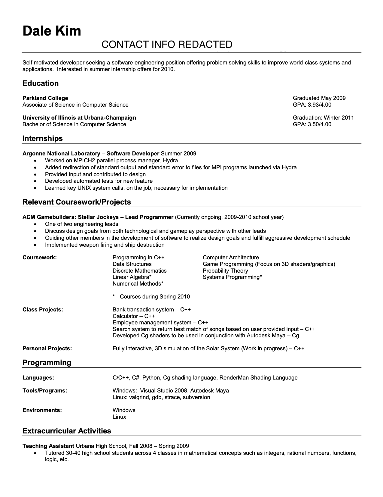
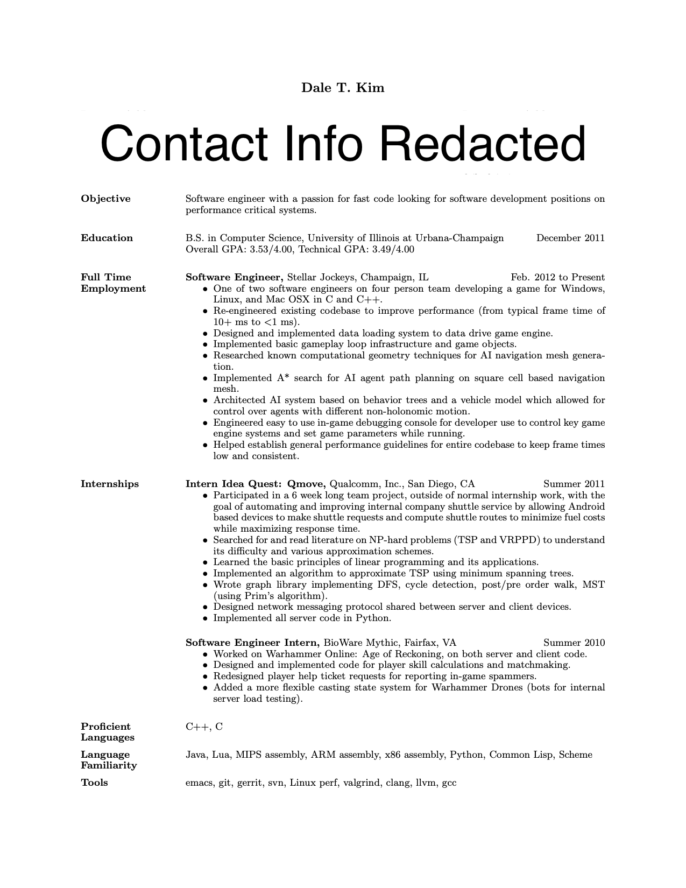

# Game Programmer Resume Tips
## Table of Contents
1. [Introduction](#intro)
2. [Resumes from the Hiring Manager Perspective](#hiring-perspective)
3. [Resume #1: 2010](#resume1)
4. [Resume #2: 2013](#resume2)
5. [Resume #3: 2016](#resume3)
6. [Final thoughts](#final-thoughts)
7. [TL;DR](#tldr)

## Introduction<a name="intro">

GDC 2020 is fast approaching and you're ready to hit the Expo floor to show your favorite game developers you're the right fit for them, right?  Or maybe you're not, in which case, these tips are for you (and even if you think you're ready, you should probably read anyways)!

Here, I will go over actual resumes I've used in the past and provide some top tips from myself and [@mike_acton](https://twitter.com/mike_acton) who hired me at Insomniac Games in 2016 and then at Unity in 2018.  These tips are intended for students with a programming background who would like to get their first job in the game industry.  The goal is to provide advice to hone your resume so that you get a call back for a phone screen instead of being ignored.

## Resumes from the Hiring Manager Perspective <a name="hiring-perspective">

One of the first things you should realize is that hiring managers go through tons of resumes.  I had asked Mike how many resumes he has gone over, to which he said *hundreds of thousands*.  Trying to dig a little deeper, I asked about the numbers for a typical job posting.  The conversation went something like this:

>Dale: So for a single job posting, how many resumes are interesting enough for you to give a call back?
>
>Mike: Ten.
>
>Dale: Percent...?
>
>Mike: No, ten.

People need to go through tons of resumes and at the end, only come up with single to double digit numbers of resumes interesting enough to proceed.  You need to be extremely focused and efficient on your resume if you want to be one of those resumes.  Any given resume gets about twenty seconds for the hiring manager to make a decision; if you fill your resume with a bunch of irrelevant information, then yours will likely be tossed away.  Your resume is your sales pitch, so be efficient and focused with it!

To that end, the following sections will present my past resumes and make specific criticisms for each one so you can build an intuition for what an efficient and focused resume would look like.

## Resume #1: 2010 <a name="resume1">
> 

This resume is one I had written while I was still at the University of Illinois as a fourth year student (senior, for us Americans).  I would consider this to be a very typical resume from an undergraduate student, but unfortunately, Mike and I both agree that it's largely useless.

Why is it useless?  There are multiple reasons but some of the big ones are:

* Resume is too high level
* Excessive emphasis on school work
* Extracurricular activities are of almost zero value for making hiring decisions

Let's break it down.

### Resume is too high level

Focusing on the internship section, it shows these bullets:

> * Worked on MPICH2 parallel process manager, Hydra
> * Added redirection of standard output and standard error to files for MPI programs launched via Hydra
> * Provided input and contributed to design
> * Developed automated tests for new feature
> * Learned key UNIX system calls, on the job, necessary for implementation

Every bullet point is too high level and doesn't provide sufficient context to reveal anything interesting about what I actually did during the internship.  The entirety of this section could in fact be replaced with:

> * I programmed stuff

And it would convey about the same amount of information.  So how could have this been better?

For starters, you should try to provide context as to how something you worked on was interesting.  In my particular case, I could have expanded on the redirection of stdout and stderr and some of the implementation details and constraints.  Going back into the depths of my memory, the reason why this was needed was because MPI is used to write parallel programs on supercomputer clusters and trying to gather debugging data from a program running on thousands of CPUs was quite laborious.  Normally, you would have to log in to each node and manually copy the files over the network to your machine.

The stdout and stderr redirection feature was needed to be able to have each program instance write to stdout and stderr but in reality it is sending the prints over the network and the process manager Hydra (running on some master CPU) would automatically gather that data into a single place for you to look at later.

Based on this context I just provided, some questions might arise:

* What data were you sending from the nodes to the master (JSON, formatted strings, binary)?
* Did you make the network calls yourself?
* How many CPU cores are typical?
* How much network bandwidth was used?
* What kinds of network scaling issues did you run into?
* How many prints per CPU could be supported?

Providing more info that would have answered any of these questions would have been a vast improvement.

### Excessive emphasis on school work

Personally, I think that a list of coursework you have taken provides no value on a resume for entry level game programming positions.  It is assumed that you are familiar with all of these things and none of the coursework indicates anything noteworthy or distinctive about yourself.  All you end up doing is wasting space on the page when you could have shown something else that you have done!

### Extracurricular activities

It's relatively common for people to add non professional interests and hobbies on their resumes, but I don't think it's a good use of space for two main reasons.  Firstly, it really only serves to hurt you (what if the person looking at the resume has a poor opinion of your hobby?).  Secondly, no one cares, so why are you putting it on your resume?

## Resume #2: 2013 <a name="resume2">
> 

This resume is only a mild improvement over my previous one.  The main improvement comes from dropping the coursework section and most of the resume focuses on actual work I've done.  Unfortunately, that's where the improvements end.  It still remains far too high level and relies on verbs like "designed", "implemented", "architected" to make a bullet point sound more impressive but provides no context to actually support that something in-depth was done.

Consider this bullet point:

> * Designed and implemented data loading system to data drive game engine

As a reader that knows nothing about you (other than what's on your resume), I have no context to work with that might tell me what the design constraints were for your data loading system.  Without that context, I can't establish that what you did was novel or interesting in any way, so I'm forced to assume nothing and therefore, not interesting.

I've mentioned that you want to be interesting several times and maybe you're wondering what that even means?  It's highly subjective and there isn't just one answer but Mike and I have similar views on what that means for a resume.  Take this as an example:

> * Implemented A* search for AI agent path planning on square cell based navigation

This is not interesting.  Why?  Everyone knows how to implement A\*; it's not particularly novel or new and most people can implement a basic A\* search within a few hours.  What would have been interesting is if you started with A\* and did a deep dive into the problem.  Maybe you figured out a way to do pathfinding without having to search a graph?  Did you find out how to do pathfinding in a completely dynamic world?  What Mike says is he looks for curiosity (watch [https://youtu.be/qWJpI2adCcs?t=3303](https://youtu.be/qWJpI2adCcs?t=3303)).  Are you willing to go really deep and find out everything you can about something or are you going to say that you don't need to know and don't care?

To expand on that, let's use this part of my resume as an example:

> * Researched known computational geometry techniques for AI navigation mesh generation

This entire bullet is getting at the fact that I spent a lot of time looking at Delaunay triangulation techniques within the context of navigation mesh generation.  I had wanted to do that just because I had heard many other games did something similar.  The problem I had was that each AI agent was represented as a circle and had a radius that would limit its movement abilities (ie - if an opening was smaller than its diameter, it can't pass through).  The navigation mesh had to have the ability to encode that information so that when I performed pathfinding, it didn't try to generate paths that a unit was too large to follow.

Most of my Google searching showed me various ways people solved this problem which amounted to generate the nav mesh while accounting for the unit size and make sure that each size uses the corresponding nav mesh when pathfinding.  I wasn't too fond of having multiple nav meshes since we had a lot of units of various sizes.  To make matters worse, I did not want to have to grab a library to do the triangulation or implement my own; I was convinced there was another way to do this that was simpler.

Ultimately, I realized that due to the restrictions of our game, all of the static level geometry was built on square tiles and I didn't even need to bother with triangulating a nav mesh.  Instead, I could keep track of all the initially obstruction free tiles of the level (no tile could become obstructed later, except by dynamic obstacles), build the largest square that fills a contiguous open area and then build portals between open areas.

Because each square is convex, I can count on every point inside and along the border of a square to be visible from every other point.  I can then be guaranteed that any portal from one square can be seen by any other portal that's also part of the same square.  The pathfinding is performed on these squares and portals.  But what about the unit sizes?  Well, because I'm dealing with portals that only enter/exit squares, it's trivial for me to handle unit sizes by simply checking the portal width against the unit diameter (the triangle case for this check is much more complicated, think a little bit about why that might be the case).  If the portal is too small for the unit, then that portal can't be considered during the pathfinding search and effectively removes a neighboring square from being accessible.  Once I have the list of portals a unit must pass through, I run a simple string pulling algorithm to make sure the path is tight against the portals so I get the shortest possible path.

The previous four paragraphs above provide more detail that could catch the attention of someone reading the resume, but I failed to put any of that information in it!  This is where being efficient with your resume is really important because you can't afford to put four whole paragraphs on a resume.  Here's my stab and conveying that information:

> * Investigated Delaunay triangulation for nav mesh generation and ultimately settled on square based cells.  Squares were chosen over triangulation due to simplicity of code and well suited for game's design.  Portals are generated between walkable cells and width is taken into account for various unit sizes.  Convexity of squares guarantees portals in/out of cell are in line of sight of each other and simple string pulling algorithm on A* path creates the shortest path.

Notice that the bullet is much longer but it actually has enough information for people to latch on to and compare/contrast with things they have done.  Because of the extra detail, it's also possible to make a judgement about whether or not the person goes beyond a cursory Google search of popular algorithms and implements only that or instead, tries to figure out something more and makes use of their game context effectively to come up with a solution.

## Resume #3: 2016 <a name="resume3">
> 

This is the resume I used when I applied to Insomniac Games in early 2016.  Of all the resumes I've written, this one is by far the best but it still suffers from failing to provide sufficient context.  The good parts:

> * Rewrote inherited codebase (mostly Lua) intended for low asset load, simple 2D sprite game to C++ for increased performance and game complexity. Code routinely supports levels with 17k static physical bodies and 275 AI agents running at 5 ms frame times (Core i7-5820k and Nvidia 970 GTX) in a single threaded application.
> * Designed pack file format to reduce game asset loading times, improve deployment time to Steam, and support live-editing of game data.  Pack file generation time on about 14800 loose files (480 MB total): 5 seconds (cold disk cache, SSD).

The context here is hugely valuable and helps the reader understand what you were dealing with and what you achieved.  Just mentioning performance numbers like "5 ms frame times" means nothing if you don't provide the hardware that was used to measure the performance (luckily, I did).

The bad parts:

> * Implemented debugging GUI using Omar Cornut's "dear imgui" (https://github.com/ocornut/imgui) library to facilitate easy live-editing of game data and inspection of game state.
> * Used data-oriented design, where possible, in gameplay code to make gameplay logic simpler to write and increase optimization opportunities.

These say almost nothing because it still remains too general and broad.

> * Wrote multiple A* pathfinding implementations before settling on a final version based on a square cell nav mesh with varying sizes.  Nav mesh automatically generated based on tile map layout.
> * Researched and implemented collision avoidance algorithms for AI agents.  Algorithm chosen was Optimal Reciprocal Collision Avoidance (http://gamma.cs.unc.edu/ORCA/).
> * SSE optimized certain phases of collision avoidance algorithm and maintained non-SSE version for debugging and ground-truth testing.

Here, three bullet points are spent on pathfinding and related areas.  One would have sufficed, especially if more detail was given on the whole approach.  The first bullet mentions having written multiple A* implementations, as if that is a great task or feat, but everyone writes things multiple times so it's not that interesting.

> * Optimized key spatial queries to improve overall frame time (from avg of 8.3 ms to 3.8 ms on test level).

Too broad and non-specific.  Optimized how?  Taken super pessimistically, this could mean you forgot to enable optimizations on the translation units dealing with spatial queries and then you slapped on -O2 when you invoked the compiler.

> * Performed basic memory optimization to reduce virtual memory pressure.  Large FMOD banks were moved out of pack file and streamed in as necessary.  Yielded memory savings on the order of 150 MB.

The phrase "basic memory optimization" is utterly meaningless and the whole bullet needs more information for it to be valuable because 150 MB of memory savings can be trivially achieved in many games by simply changing texture compression settings.  What do you mean by virtual memory pressure?  Why is the memory optimization related to moving large FMOD banks out of the pack file?

Something that I have yet to mention is the contact info section and objective statement.  These things are largely a waste of space and I would strongly recommend that you either remove them or shorten up as much as possible (mine is particularly egregious because I included a "Present address" on the left and "Permanent address" on the right, which were the same).  The contact section is wasteful because of modern ways of tracking resumes.  You will probably have to submit your resume with your application that already includes all the information, so using up resume space is duplicating info the employer already has.  If you're afraid that maybe you will submit a resume and *somehow* they forget how to reach you, then leave a phone number or an email but leave out the address.

The objective is also wasteful because normally, you apply for a specific position.  It's obvious that you're trying to get that job, so unless you're submitting a resume to a company without any advertised positions, you're eating up valuable resume space to make your case.  My suggestion is that you do not have an objective statement unless you specifically know that the company likes to see one or maybe you're dealing with a general application where you don't know what jobs you might be applying for.

## Final thoughts <a name="final-thoughts">
It can be very time consuming to come up with a good resume and you may find it difficult to summarize the things you have done in a single page.  How do you know when you have enough detail or not enough?  Or maybe you're not sure if what you want to put on your resume is "cool" or "interesting"?

My advice: it's less about *what* you implemented but the *how* and *why* you did it and under what circumstances.  A lot of people know how to program and implement algorithms they've looked up, but not everyone can solve problems they haven't seen before.  What people will want to see is if there's an ability for you to explore a problem space and come up with something that works under constraints.  If you can demonstrate that you can do this on your resume, it becomes much more appealing for hiring managers.  If you spend most of your resume on listing out all the programming languages you know, the engines you've worked with or well known algorithms you've implemented, don't be surprised if you don't get a call back because that's not what people are actually looking for!

Finally, even though writing resumes is hard, I highly suggest that you write different resumes for different companies so you can write to your audience.  If you're someone who really cares about low level rendering and you write a resume that shows off how you can write command buffers better than anyone else but then send that resume off to a gameplay team who makes games using Unity or Unreal, then you've probably wasted your time!  Try to find out who the hiring managers are and figure out what it is they're looking for and write to them specifically, rather than have one general resume that you use everywhere.

So, please, take this advice to heart and rewrite them so hiring managers find it impossible to ignore you!  If you want some advice on your resume before GDC 2020, let me know [@unpacklo](https://www.twitter.com/unpacklo) and I will try to give you my 20 second review.

## TL;DR <a name="tldr">
* Treat your resume as your sales pitch.  You only get 20 seconds to get someone hooked so put your best work on it and explain all the cool stuff you did.
* Your resume is too broad and non-specific, hence, not interesting.  Saying you implemented X or designed Y is not good enough.  Provide as much context as possible!
* Do not put coursework on your resume.  No one cares about this.
* Do not talk about what your employers do.  Talk about what **you** did!  Do not put anything on your resume that you're not able to talk at length about in an actual interview.  People will ask you about it.
* Assume the resume will speak for itself and that people will not look further than your resume.  If you include links to your GitHub page or a YouTube video, assume it will **not** be clicked on!
* Resist temptation to list off a bunch of programming languages and skills, as I have done in my resumes.  It's more valuable to omit that and add more detail to other parts of your resume.